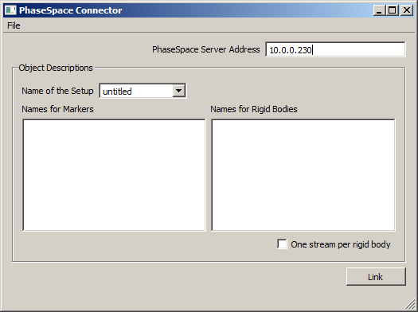

== Usage ==

This program should run out of the box without further dependencies. It should support all motion capture systems produced by PhaseSpace (http://www.phasespace.com), including Impulse and Improv.

Make sure that the PhaseSpace server is running, and that also the PhaseSpace Master application is running, connected to the server, and tracking markers properly. The filtering settings that you set in the PhaseSpace master apply also to the streams recorded by this application, even though they are received directly from the server machine. PhaseSpace must have a configuration loaded.

Start the PhaseSpace app. This should give you a window like the following:
> 

  * Set the correct address of the PhaseSpace server machine (this should be the same as the one that is set in the master program).

  * You may optionally assign names to your markers and rigid bodies (in the order in which they are defined) by filling in the respective list boxes (one line per item). For markers or rigids that were not labeled the names Marker1...MarkerN and Rigid1...RigidN will be assumed. You can also name the current marker setup for your own record-keeping.

  * To link the application to the LSL, click the "Link" button. If all goes well you should now have a new stream on the network with name "PhaseSpace" and type "Mocap".

The program connects (upon clicking link) to the given IP address of the PhaseSpace server.

== Optional ==

It is possible to assign custom names to the markers as well as rigid bodies provided by the PhaseSpace server. To do this, just type the names (one per line) in the order of appearance in the PhaseSpace Master. Any unassigned or blank lines will be taken as labels such as Marker1, Marker2, etc.

The setup itself can also be given a name.

The one stream per rigid body allows to export a separate stream for each body, which can make it a bit easier for a client program that is only interested in the movement of that body (e.g. for head tracking).

The configuration settings can be saved to a .cfg file (see File / Save Configuration) and subsequently loaded from such a file (via File / Load Configuration). Importantly, the PhaseSpace program can be started with a command-line argument of the form "PhaseSpace.exe -c myconfig.cfg", which allows to load the config automatically at start-up. The recommended procedure to use the app in production experiments is to make a shortcut on the experimenter's desktop which points to a previously saved configuration customized to the study being recorded to minimize the chance of operator error.

# Further Info
The meta-data associated with PhaseSpace streams is fairly comprehensive and describes how the various channels are related to scene objects (e.g. what objects are the various position channels referring to, etc.) -- for up-to-date information, study the meta-data that is included in your stream (e.g. after importing a test file).

The One stream per rigid body checkbox is only for cases where you have a simple program that wants to track just one of your scene's rigid bodies without having to pick it out of the channel list. It is currently untested.
